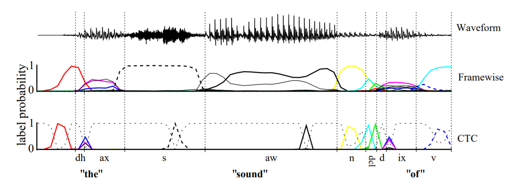
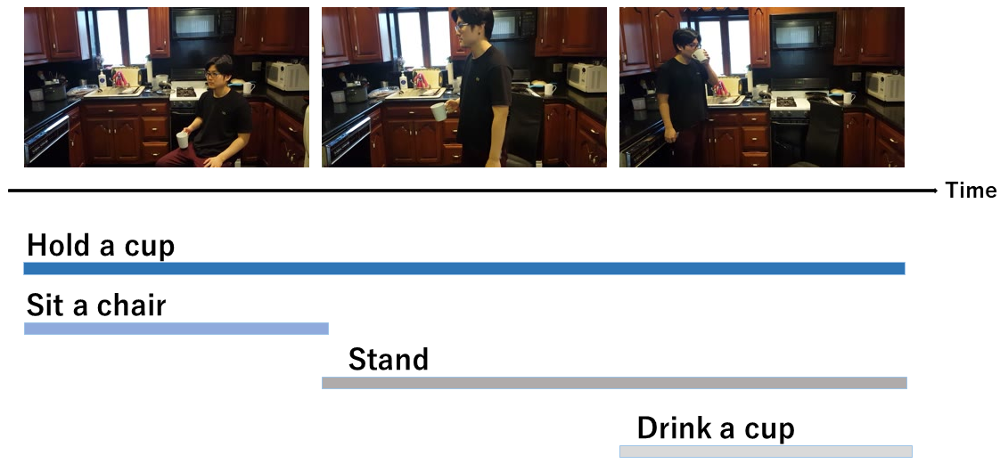
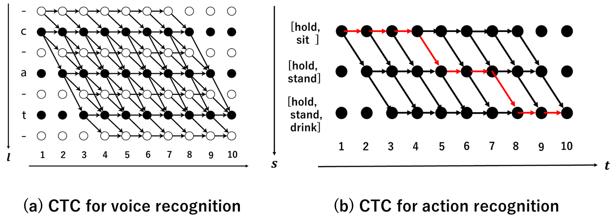

  

# No Blank Connectionist Temporal Classification

Pytorch implementation for [Connectionist Temporal Classification](https://www.cs.toronto.edu/~graves/icml_2006.pdf), but my model does not consider unvoicedness.

Contact: Takuya Goto (goto@cv.nitech.ac.jp)

## Overview

### Connectionist Temporal Classification 

Connectionist Temporal Classification(CTC) is Loss Function used in speech recognition and time series data. When estimating the label probability for each time from each unit of the LSTM in chronological order, the probability of including a blank character representing unvoiced sound is estimated.

### CTC for Human Action Prediction

An overview of our Proposed Gated Spatio-Temporal Energy Graph. Given an input instance (a video clip), we predict the output relationships (e.g., {**monkey, creep down, car**}, etc.,) by reasoning over a fully-connected spatio-temporal graph with nodes **S** (Subject),**P** (Predicate) and **O** (Object). Instead of assuming a non-gated (i.e., predefined or globally-learned) pairwise energy function, we explore the use of gated energy functions (i.e., conditioned on the specific visual observation).

## Usage

### Prerequisites
- Python 3.6
- [Pytorch and torchvision](https://pytorch.org/)

### Datasets
- [Charades dataset](http://ai2-website.s3.amazonaws.com/data/Charades_v1_rgb.tar)
- [Charades' Training and Validation Annotations](http://ai2-website.s3.amazonaws.com/data/Charades.zip)

### Pretrained Model
- Download the [pretrained (with Kinetics Dataset) I3D](https://arxiv.org/abs/1705.07750) model [here](https://www.dropbox.com/s/r6ja11h06y2w83c/rgb_i3d_pretrained.pt?dl=0). Note that I removed the last classifier layer, and append a new classifier layer for Charades.

### Run the Code
1. Modify CTC_exe.py
    * Create the cache directory
    * Specify the location of the data, training/validation split, and pretrained model.
2. Command as follows
~~~~
python3 CTC_exe.py
~~~~

### Acknowledgement
A large portion of the code comes from the [ctc](https://github.com/vadimkantorov/ctc) and [ImageNet](https://github.com/pytorch/examples/tree/master/imagenet) repo.
